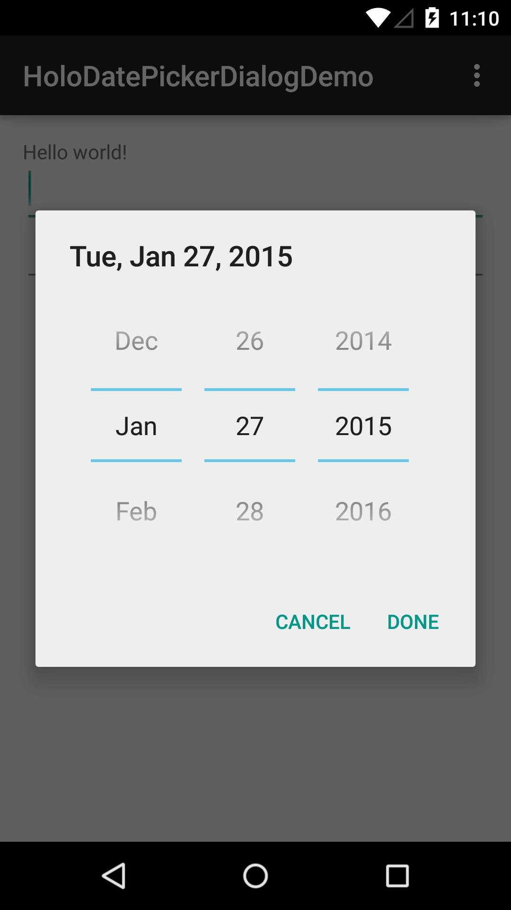
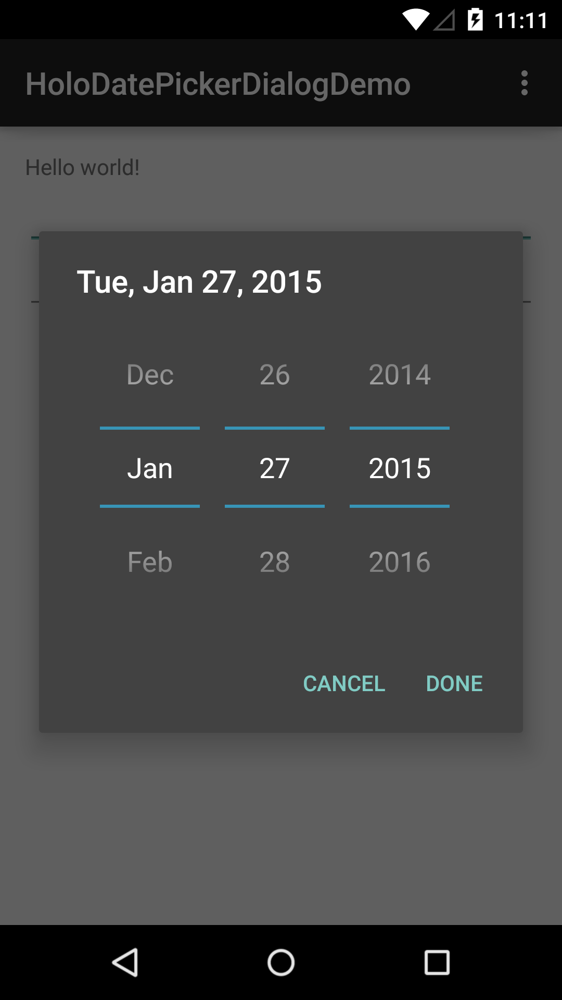

# HoloDatePickerDialog
Android backport library for Datepicker

## Screenshots



## Installation

```
repositories {
    maven { url "https://raw.github.com/dgrigutsch/HoloDatePickerDialog/master/" }
}
```

```gradle
 compile 'bitninja.de:holo-datepicker:0.1.0'
 ```
 
## Usage

```
SpinnerDatePickerFragment datePickerFragment = SpinnerDatePickerFragment.newInstance(
                new CalendarDatePickerDialog.OnDateSetListener() {
                                 @Override
                                 public void onDateSet(DialogFragment dialogFragment, int i, int i2, int i3) {
                                     try {
                                         Calendar c = Calendar.getInstance();
                                         c.set(year, monthOfYear, dayOfMonth);
                                         SimpleDateFormat sdf_a = new SimpleDateFormat("yyyy-MM-dd");
                                         DateFormat sdf_b = SimpleDateFormat.getDateInstance();
                                         String mDateString = sdf_b.format(c.getTime());
                                         String mDateBackend = sdf_a.format(c.getTime());

                                         mDateEditText.setText(mDateString);
                                         data.onValueChanged(mDateBackend, data.position);
                                     } catch (Exception e) {
                                         e.printStackTrace();
                                     }
                                 }
                             }
                );
```

This library is based on Holoeverywhere.
https://github.com/Prototik/HoloEverywhere


